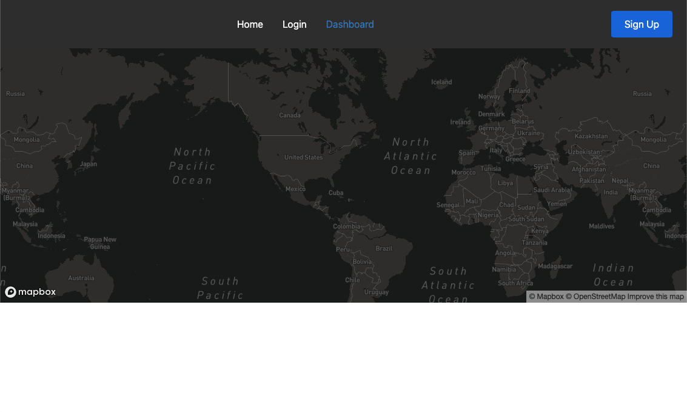

# Voyagr

  
  
  
  

  ## Table of Contents 
  * [Description](#Description)
  * [Project URL](#Project-URL)
  * [Mock-up](#Mock-up)
  * [Usage](#Usage)
  * [Credits](#Credits)
  * [License](#License)
  * [Features](#Features)
  * [Tests](#Tests)
  * [Resources](#Resources)
  * [Contact](#Contact)
  * [Designed and built by](#Designed-and-built-by)
  #
  
  ## Description 
   Voyagr is a mobile first full stack application (MERN) that features a user dashboard highlighted by a world map that enables the user to document their journey around this amazing planet with pin markers, simply put Voyagr is a digital cork board pin map.

  ## Deployment
  Comming Soon!

  ## Project URL
  https://github.com/Kayvonk/voyagr

  ## Mock-Ups
  <table>
  <tr>
    <td>Voyagr App Dashboard</td>
  </tr>
  <tr>
    <td></td>
  </tr>
 </table>

  ## Installation 
  No installations required at this time 

  ## Usage 
  It’s simple. Create an account -> login -> and start pinning your journeys to your own personal world map including photos, a description.

  ## Credits 
  Kayvon Kazemini, Robert Johnson, Koffi Danhounsrou

  ## License 
  This project is [mit](https://choosealicense.com/licenses/mit/) licensed.

  ## Features
  Coming soon!

  ## Tests
  `yarn test`

  Launches the test runner in the interactive watch mode.\
  See the section about [running tests](https://facebook.github.io/create-react-app/docs/running-tests) for more information.

  ## Resources
  This project was bootstrapped with [Create React App](https://github.com/facebook/create-react-app).

  * [Inquirer](https://www.npmjs.com/package/inquirer) 
  * [Mapbox](https://www.mapbox.com/)
  * [React-Map-GL](https://visgl.github.io/react-map-gl/)
  * [React-Hook-Form](https://react-hook-form.com/)
  * [Heroku](https://www.heroku.com/)
  * [MongoDB](https://www.mongodb.com/)
  * [Passport](http://www.passportjs.org/)
  * [Choose a License](https://choosealicense.com/)
  * [Badmath](https://img.shields.io/github/languages/top/nielsenjared/badmath)
  * [shields.io](https://shields.io/)
  * [YouTube](https://www.youtube.com/)
  

  ## Contact
  Emails: 
  * kayvonk@gmail.com
  * robertcjohnson1984@gmail.com 
  * koffi.danh@gmail.com

  ## Designed and built by
  Author(s): 
  * Kayvon Kazemini (https://github.com/Kayvonk) 
  * Rob Johnson (https://github.com/johnsonr84/) 
  * Koffi Danhounsrou (https://github.com/Koffidanh)

